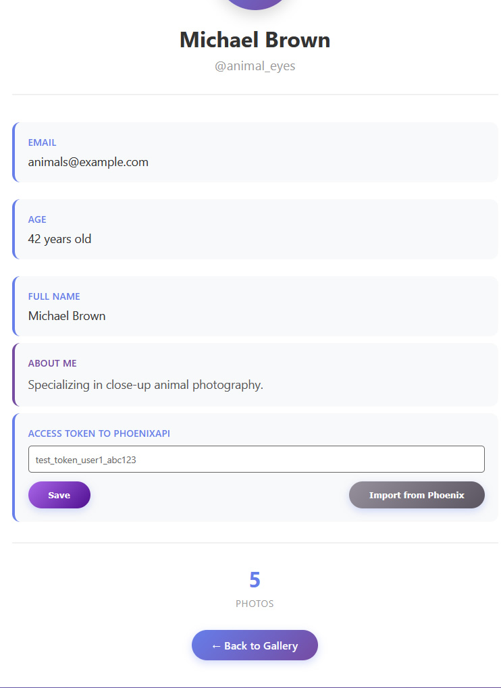
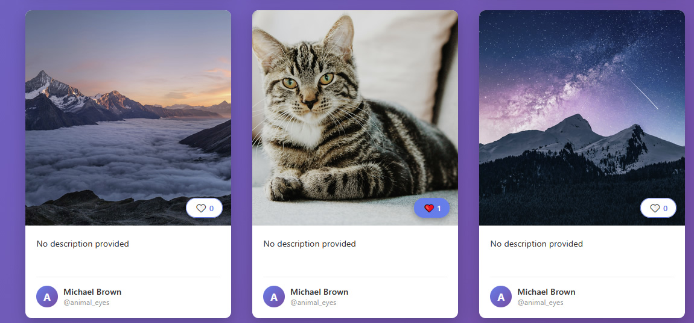

## Zadanie 1.

1. Można było się zalogować tokenem innego użytkownika. 

sampel: http://localhost:8000/auth/wildlife_pro/9e3c05f8d2aad0fb5f655fc0893a55d0232d4302adf8f6d5be984fa523f64ffa

Od razu to czego mi zabrakło to przycisku do logowania. Proces autoryzacji powinien posiadać własną formatkę email/pass, zaloguj za pomoca google, facebook.

2. Zauważyłem że zmienne przekazane w url są bezpośrednio podstawiane pod zapytania sql, taki system można w prosty sposób wywalić za pomocą sql injection. 

Punkt 1 i 2. Skorygowane w AuthController.php za pomocą fetchAssociative gdzie "pod spodem" jest znane mi już PDO i tam są mechanizmy które automatyczcnie escapują wartości zmiennych. W sumie AI podpowiedział że executeQuery tez escapuje ale trzba użyć bindowania zmiennych a nie przekazywac zmienne  w stringu sql.

PS: pomijam tutaj fatal errory gdy nie przekażemy parametrów username i token do route /auth/{username}/{token}, bo to juz jest oczywiste - nie korygowałem tego.

3. Nie podoba mi się to że mimo iż kliknę wyloguj to nadal moge wrócić na stronę profilu. (back history) tutaj trzeba dodać warunek jak brak sesji to redirectToRoute('home'), też tego nie korygowałem.

4. Like'owanie swoich zdjęć chyba nie jest błędem do wykrycia :)

5. Like'owanie odświeża stronę, co na wersji mobilnej przewija całość do góry i będzie bardzo irytyujące dla usera, ta funkcja powinna być przerobiona na request wysłany za pomoca javascript (np wysłany ajaxem).  

6. Brak responsywnego photo-grida, na poszczególnych breakpointach widok jest obcinany.

dodałem w templates/home/index.html.twig dodatkowy css z breakpointami dla klasy .photo-grid

7. Okragły przycisk dostępu do profilu nachodzi na logotyp "insta shot" - na widoku mobile width < 450 px

8. Pola w bazie w tabeli users typu varchar są zdecydowanie za długie, username, email 255 znaków ??? W późniejszym czasie gdy będzie potrzeba dużo indeksów to niepotrzebnie zabieramy zasoby pamięci podręcznej.

9. Dodałbym jakiś mechanizm lazy loading dla zdjęć aby nie wywalić serwera ze zdjęciami mechanizm stronicowania polegający na doczytywaniu się tych fotek podczas skrolowania.

10. Sprawdziłem bazy i relacje są ustawione poprawnie włącznie z kaskadowym usuwanie. Samego usuwania nie przeprowadzałem ale wygląda ok. Może tylko dla apki symfony dla wszystkich tabel id dałbym typu bigint.

## Zadanie 2.

Tutaj nie miałem większych problemów.

Po urlu sprawdzam czy takie zdjęcie nie zostało już zaimportowane. W pętli zapytaniem sprawdzam czy dany obrazek jest już przypisany do danego usera w bazie, pobranie wszystkich urli do obrazów usera z symfony-app i sprawdzanie za pomocą in_array() byłoby na pewno mniej obciążające dla bazy danych.

Można tutaj w profilu usera rozbudować formatkę o udostpenione zdjęcia z możliwością kategoryzowania lub usuwania fotek. Formatkę do wgrywania dużej ilośći zdjęć poprzez drop area itp, automatyczne przycinanie, kompresję do webp itp.

## Zadanie 3.

## Podsumowanie i testy jednostkowe

Nie wprowadzam do repozytorium testów jednostkowych ponieważ tak jak podałem przy rozmowie z Natalią, nigdy w dotychczasowej pracy ich nie tworzyliśmy. Testy wykonywaliśmy manualnie, na wszystkich przeglądarkach jak jeszcze królował IE i urządzeniach mobilnych etc :) także layouty RWD badane była manualnie na dev i ponownie później na produkcji.  

Mimo to wygenerowałem je sobie w AI i nie stanowią dla mnie większego problemu, kilka wieczorów i chyba temat do ogarnięcia. Tym bardziej, że podstawy mam, ponieważ dość często korzystam z mechanizmu skrapowania dynamicznych stron znajdujących się za różnymi mechanizmami recapcha, i np c# w visual studio używam pakietów Selenium Chrome WebDriver, gdzie dzięki selector badam czy dany element już się pojawił i co wykonać dalej.

W obecnej firmie ponad 20 lat rozwijaliśmy dedykowane oprogramowanie, orogramowanie które sprzedawaliśmy także naszym klientom, niektórzy prosili nas o support ich obecnych  środowisk w Laravelu, frameworku Zend, od kilku lat wspierałem także ecommerce Kakadu.pl napisany i niesamowicie skustomizowany na Prestashop. 

W Symfony jestem nowicjuszem. Na frontendzie używam generalnie jQuery i Bootstrap'a. Angualr i React zapewne do ogarnięcia, ale do tej pory nie pisałem nic w tych frameworkach. Na życzenie mogę udostępnić demo mojego autorskiego systemu CMS, napisanego w czystym PHP na którym postawiłem ponad 20 serwisów internetowych i aplikacji. 
Generalnie CMS ukazuje estetykę jaką się posługuję, wyłuczoną wieloletnią pracą z firmami kosmetycznymi.

Jęz. angielski coś pomiędzy B1 a B2, w dokumentacji i mailach bez granic, werbalnie raczej proste do ogarnięcia tematy.

Serdecznie pozdrawiam, życzę miłego dnia 
Grzesiek